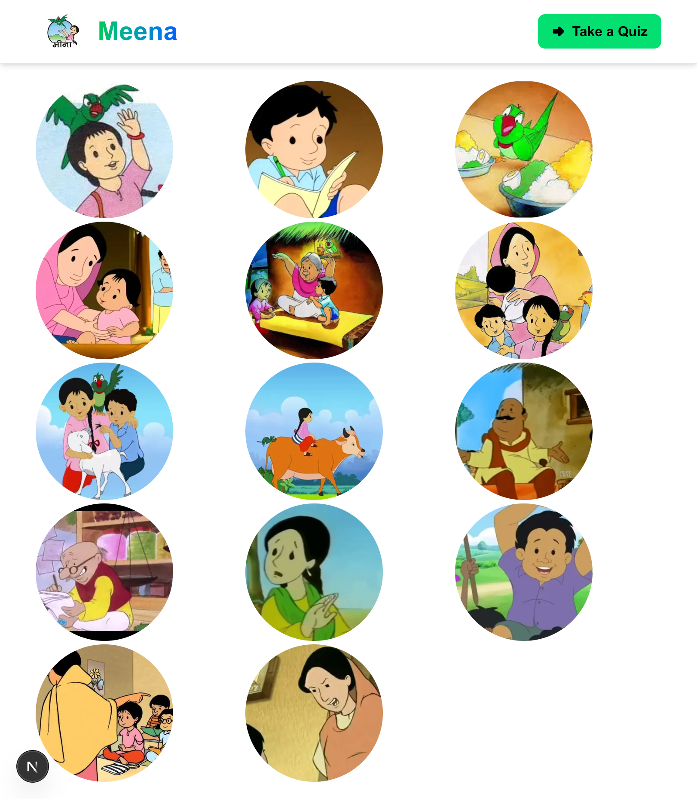
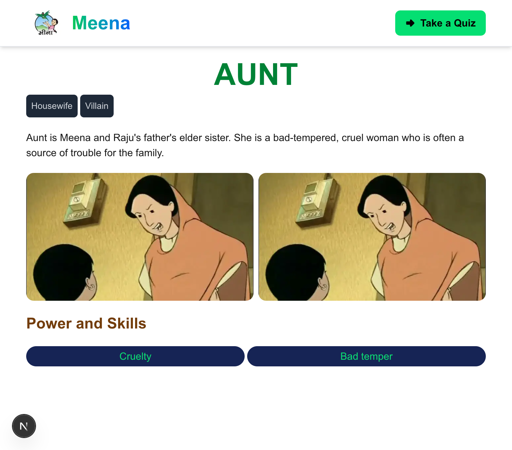
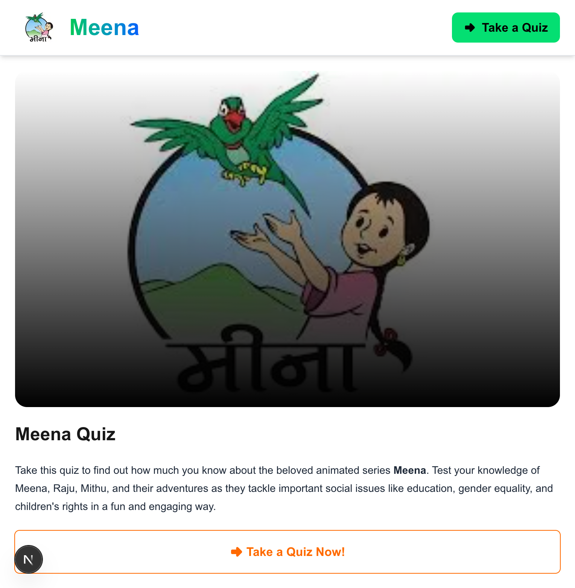
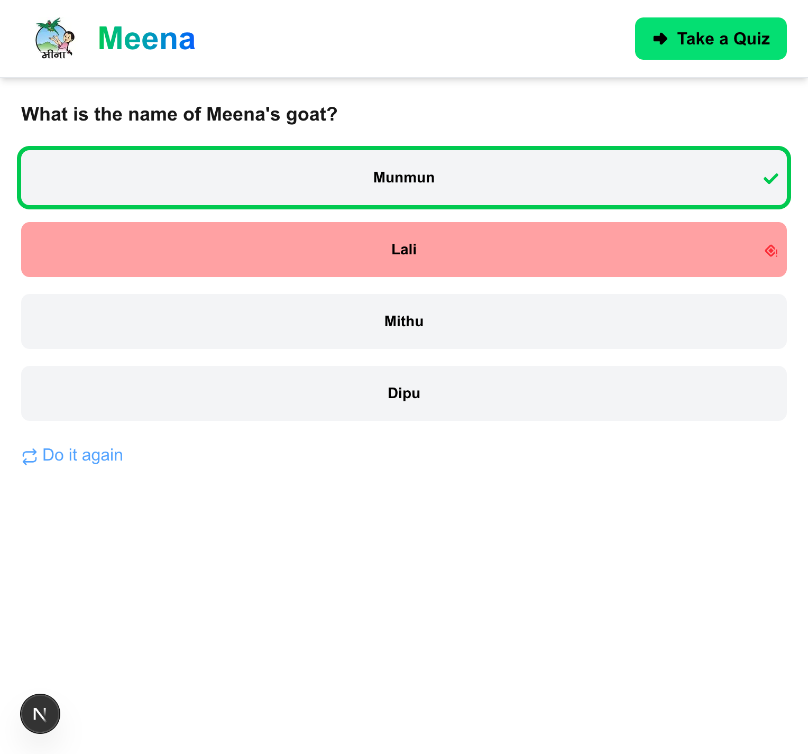

# Meena 

## Overview
This project is a **full-stack web application** built using **Next.js**. It showcases information about the cartoon series **Meena**, featuring character details and a quiz section where users can test their knowledge about the show.

## Website Preview
### Home Page
Users can select a character to learn more about them.


### Character Info Page
Displays detailed information about the selected character.


### Quiz Page
Users can take a quiz related to Meena characters.


### Quiz Question Page
A random quiz question appears, and users submit answers to check correctness. Using "Do It Again," users can attempt another question.


### Steps to Run Locally
```bash
# Clone the repository
git clone https://github.com/ripa01/Meena.git

# Navigate to the project directory
cd meena

# Install dependencies
npm install  # or pnpm install

# Start the development server
npm run dev  # or pnpm dev
```

Now, open [http://localhost:3000](http://localhost:3000) in your browser.

## Built With
This application was built following the tutorial from [freeCodeCamp](https://www.freecodecamp.org/news/build-a-full-stack-application-with-nextjs/).


